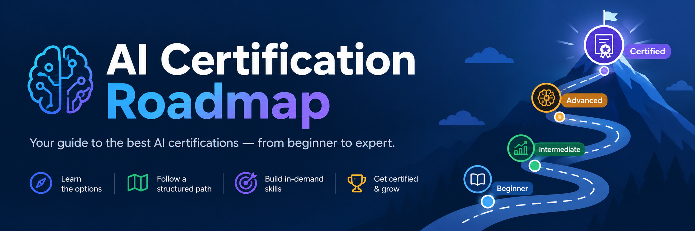

# AI Certification Roadmap

**Find the AI certification that fits your work, and see what comes next.**

The roadmap maps more than 50 AI certifications from vendors such as AWS, Microsoft, Google Cloud, NVIDIA, Anthropic, ISACA, GIAC and CompTIA. Each one is placed in a **domain** (what it proves) and a **level** (how much experience it expects). Pick your domain, start at L1 and climb.

## What you can do

- **Browse by domain and level** in the Roadmap view, or as cards in the List view. On phones, the page always uses the List view.
- **Search** by exam code, name, vendor or domain. Press <kbd>/</kbd> to jump to the search box.
- **Filter** to certifications launched in 2025 or later, or to a single vendor.
- **Open any certification** to see what it covers, its prerequisites, the exam fee, its status and a link to the vendor's page.
- **See fees in your currency.** Choose from 17 currencies (see [Fees and currencies](#fees-and-currencies)).
- **Switch between light and dark themes.** By default the page follows your system setting.

## How certifications are placed

| Domain | What it covers |
|---|---|
| AI Literacy & Adoption | Understanding AI, business adoption, admin fundamentals |
| ML Engineering & MLOps | Training, deploying and running models |
| GenAI & Agent Development | Building LLM applications and agents |
| AI Infrastructure | GPU clusters, networking and operations |
| AI Quality & Testing | Testing AI systems, and testing with AI |
| AI Security | Securing and defending AI systems |
| AI Red Teaming | Attacking AI systems to find weaknesses |
| AI Governance, Risk & Audit | Policy, compliance, risk, audit, ISO/IEC 42001 |

| Level | Meaning |
|---|---|
| **L1** Foundational | No experience or prerequisites required |
| **L2** Associate | Some hands-on experience recommended |
| **L3** Professional | Roughly 1–3+ years of experience recommended |
| **L4** Expert | Senior roles; usually requires another certification first |

A certification goes in the domain it *proves*, not the one its vendor belongs to. If its title and the experience it recommends disagree, the recommended experience decides the level. The full rules, including tie-breakers, are in [PLACEMENT.md](PLACEMENT.md).

## Accuracy and sources

Each certification is marked as either **checked on the vendor's page** or **from industry reports**. The page footer shows when the data was last reviewed. Exam fees change and vary by region and membership, so always confirm on the vendor's page before you book.

Retired certifications, such as AWS Machine Learning Specialty and Microsoft AI-900, are left out and listed in the footer instead.

### Fees and currencies

Fees are stored as US-dollar exam prices. The currency picker converts them in your browser using daily European Central Bank exchange rates from [Frankfurter](https://frankfurter.dev), a free service that needs no account. Converted fees are marked with `≈`, and the card still shows the US price. Some vendors set their own regional prices, so the converted amount is a guide rather than a quote.

The default currency comes from your browser's region, for example British English → GBP and German → EUR. Anything else defaults to US dollars, which are the vendors' own list prices. The page remembers your choice. If the rates can't be loaded, fees are shown in USD.

## Suggest a certification

Missing one, or spotted an outdated fee? [Open a suggestion](https://github.com/elliotborryn/ai-certification-roadmap/issues/new?template=suggest-certification.yml), or use the **Suggest one** link at the bottom of the page. Every suggestion is checked against the vendor's official page before it's added.

---

© 2026 Elliot ([@elliotborryn](https://github.com/elliotborryn)). All rights reserved.
